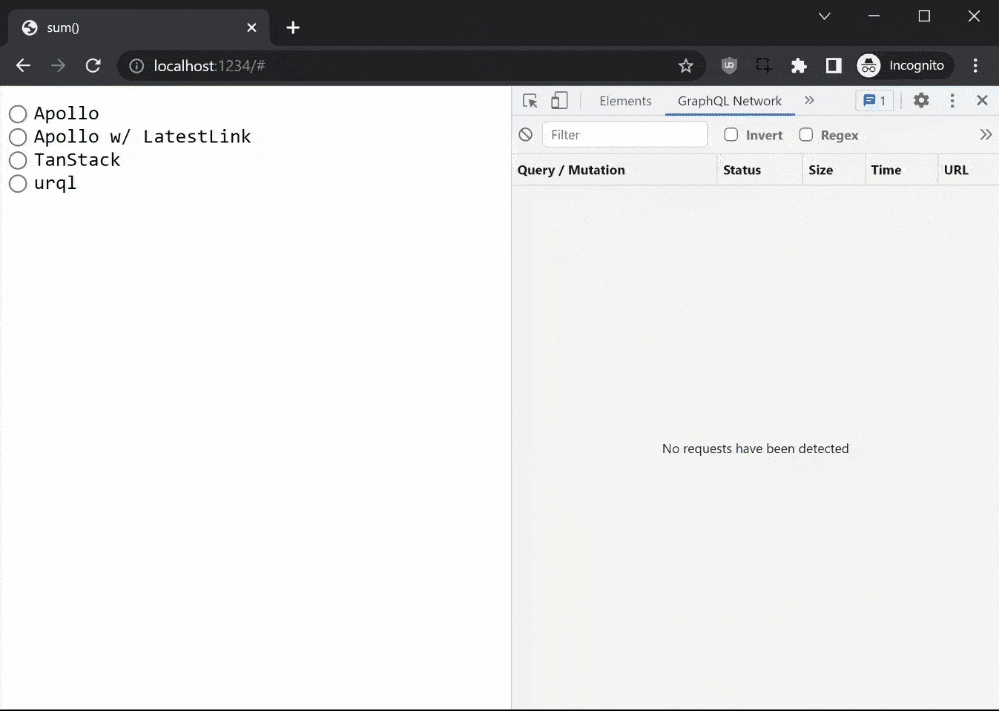

# graphql-playground

GraphQL client data fetching and caching playground.

Each demo consists of 3 components:

1. `<Numbers>` consists of an input field which expects a comma separated list of numbers that are saved on blur; `mutation SaveNumbers`
1. `<First>` that fetches the first number saved; `query GetNumber`
1. `<Sum>` that fetches the sum of the numbers; `query GetSum`

## Apollo Client

⭐ 18k

- allows for direct cache manipulation (limited API)
- `refetchQueries` only works on watched queries (= queries in rendered components)
- there are libraries out there to manage cache updates, but they are [hacky](https://github.com/ecerroni/apollo-cache-updater/blob/master/src/index.js#L197-L207)

## Apollo Client with IsLatestLink & useLatestQuery

✅ addon on top of what we have

🔶 hacky

### Constraints

1. A query should not skip cache unless explicitly told to do so
  - Example: query *Q* ignores LatestLink before mutation *M* ran
  - Example: query *Q* uses cache, mutation *M* modifies state, query *Q* skips cache
2. A unique query has to be marked as having the latest data
  - Example: query *Q1* uses cache under key *K*, query *Q2* with key *K* skips cache
3. Don't grow the internal map too large
  - Example: orphaned queries that never get cleared

## [NerdWallet ApolloCachePolicies](https://github.com/NerdWalletOSS/apollo-cache-policies)

⭐ 121

✅ addon on top of what we have (`InMemoryCache`)

🔶 how much maintenance will this have? what are its bugs?

- [invalidation policies](https://github.com/NerdWalletOSS/apollo-cache-policies#summary-1) introduce event-based (`onWrite`, `onEvict`) policies between parent/child type entities.
- [type TTL](https://github.com/NerdWalletOSS/apollo-cache-policies#summary) which would replace our `useTtlQuery`

## [urql](https://formidable.com/open-source/urql/)

⭐ 8k

✅ easier to migrate to with a better cache API

🔶 we will have to write our own cache invalidation as part of an ["Exchange"](https://formidable.com/open-source/urql/docs/graphcache/) which won't live with the query/mutation itself

- same(ish) API and approach as Apollo
- cache management (by default is a document cache but we'd want to use a normalized cache) is handled via an ["Exchange"](https://formidable.com/open-source/urql/docs/comparison/) which might be easier to extend upon as they cover both caching and what Apollo calls "Links" (= network requests)
  - [`cache.invalidate`](https://formidable.com/open-source/urql/docs/graphcache/cache-updates/#invalidating-entities) lets us essentialy walk and discard any cache fields
  - writing of the mutation updates and query links can be made easier using [schema awareness](https://formidable.com/open-source/urql/docs/graphcache/schema-awareness/)

## [React Query](https://tanstack.com/query) *née TanStack Query*

⭐ 31k

✅ most powerful cache (and beyond) control, highly composable/extensible

🔶 most difficult to migrate to

- can pass [`invalidateQueries`](https://tanstack.com/query/v4/docs/guides/query-invalidation) which can invalidate a query that starts with a key (without immediately re-excuting it unless it's being currently rendered by useQuery)
	- the key prefixes/matchers are [powerful](https://tanstack.com/query/v4/docs/guides/filters#query-filters)
- supports time-based [cache expiry](https://tanstack.com/query/v4/docs/guides/caching) meaning it could replace our `useTtlQuery`
- does NOT come with a data fetching library out of the box (= backend agnostic)
- supports [optimistic updates](https://tanstack.com/query/v4/docs/guides/optimistic-updates)
- there is an (experimental) [`broadcastQueryClient`](https://tanstack.com/query/v4/docs/plugins/broadcastQueryClient) that shares state across multiple browser tabs

## [SWR](https://swr.vercel.app/)

⭐ 25k

Might as well use React Query with a better API.
