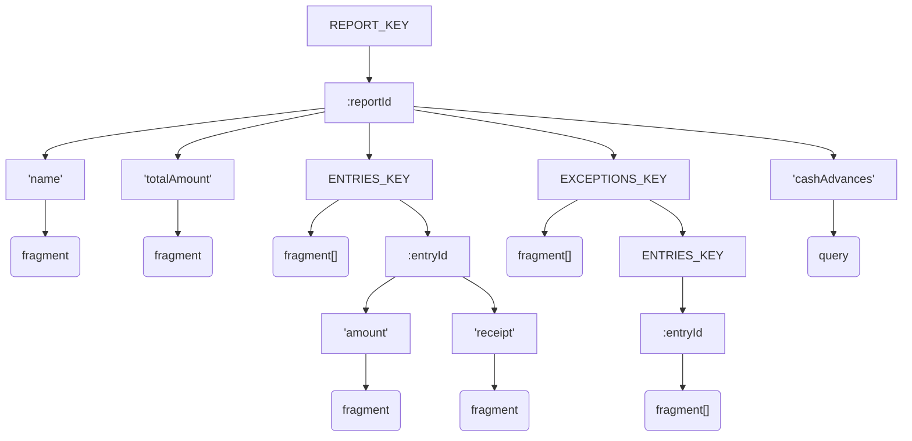

# Keys

```mermaid
graph TD
  A[REPORT_KEY] --> B[:reportId]
  B --> C['name'] --> S(fragment)
  B --> D['totalAmount'] --> T(fragment)
  B --> E[ENTRIES_KEY]
  B --> G[EXCEPTIONS_KEY] --> V("fragment[]")

  E --> Z("fragment[]")
  E --> H[:entryId]
  H --> I['amount'] --> W(fragment)
  H --> J['receipt'] --> X(fragment)

  G --> K[ENTRIES_KEY]
  K --> L[:entryId] --> Y("fragment[]")

  B --> F['cashAdvances'] --> U(query)
```

The hierarchy of query keys and associated fragments.
