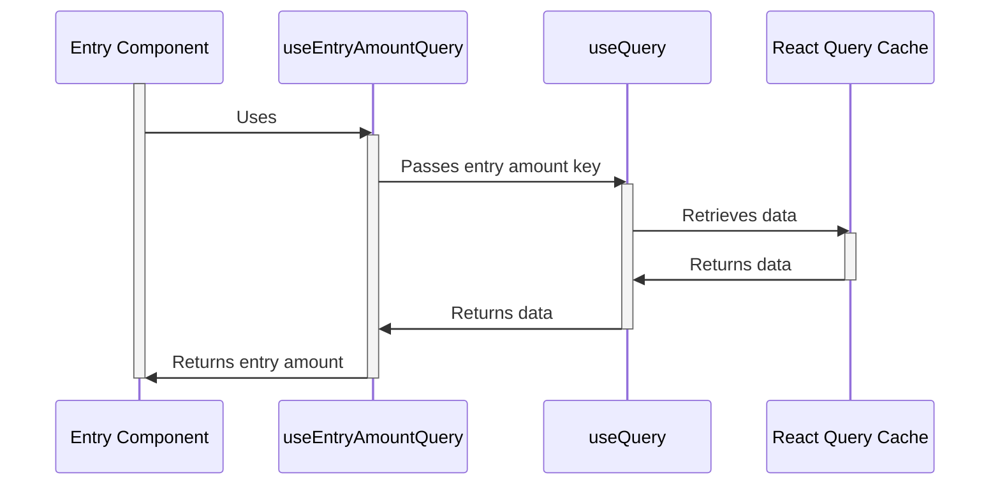

# Render entry amount

`Entry` component uses the `useEntryAmountQuery` hook to read the entry amount. This hook uses `useQuery` hook passing in the entry amount key. `useQuery` uses React Query behind the scenes to return the data under this key stored in the cache.
