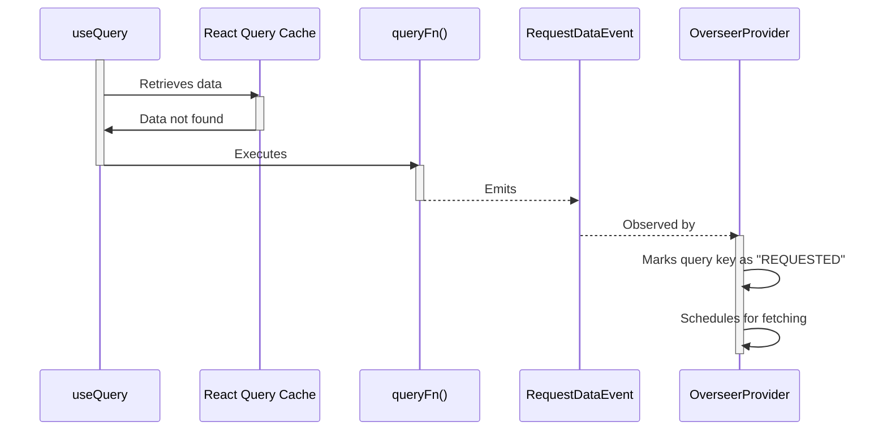

# useQuery

The `useQuery` hook retrieves data from the React Query cache under a given key. If the data is not in the cache, the `queryFn` function gets executed.
This function emits a `RequestDataEvent` which is observed by the `OverseerProvider`.
This provider then marks the query key as "REQUESTED" and schedules it for fetching.
