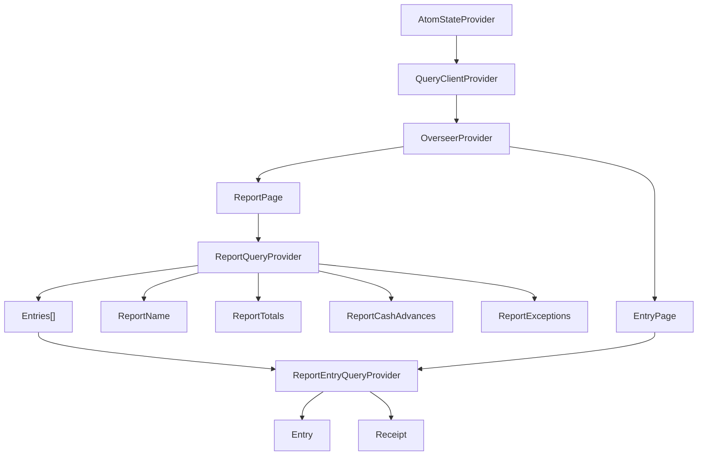

# Component Hierarchy

- AtomStateProvider
  - QueryClientProvider
    - OverseerProvider
      - ReportPage
        - ReportQueryProvider
          - ReportName
          - ReportTotals
          - ReportCashAdvances
          - ReportExceptions
          - Entries[]
            - ReportEntryQueryProvider
              - Entry
              - Receipt
      - EntryPage
        - ReportEntryQueryProvider
          - Entry
          - Receipt
