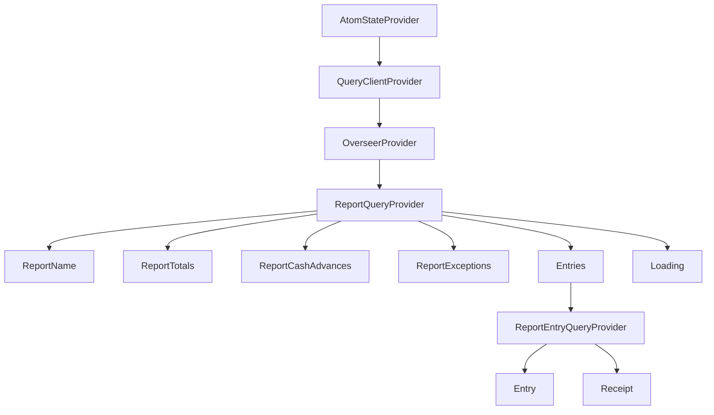

# Component Hierarchy

- AtomStateProvider
  - QueryClientProvider
    - OverseerProvider
      - ReportQueryProvider
        - ReportName
        - ReportTotals
        - ReportCashAdvances
        - ReportExceptions
        - Entries
          - ReportEntryQueryProvider
            - Entry
            - Receipt
        - Loading
