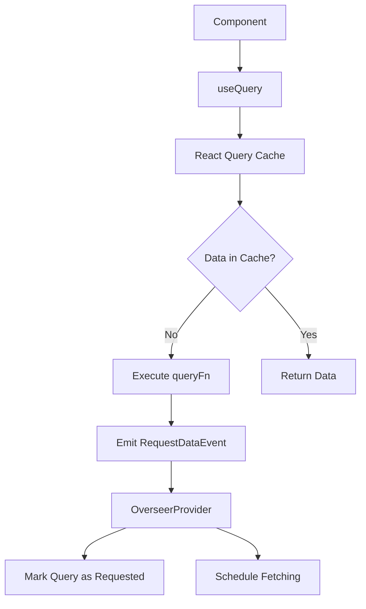

## Data Flow

The `useQuery` hook always only returns data from the cache under a query key. If the data is "STALE", the `queryFn()` function is used to emit a `RequestDataEvent` that `OverseerProvider` subscribes to, scheduling a fetch.
