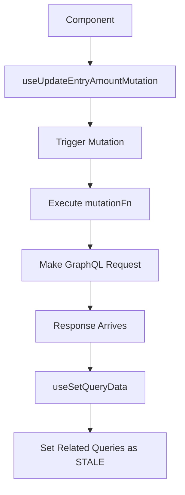

# Mutation Flow

When a mutation settles, the `useSetQueryData` hook is used to mark related queries as "STALE". This doesn't immediately fetch them! Instead we wait for any components that use these query keys to tell us that they are requesting this data. This way we can mark data as stale without immediately incurring a network request if nobody cares about them.
