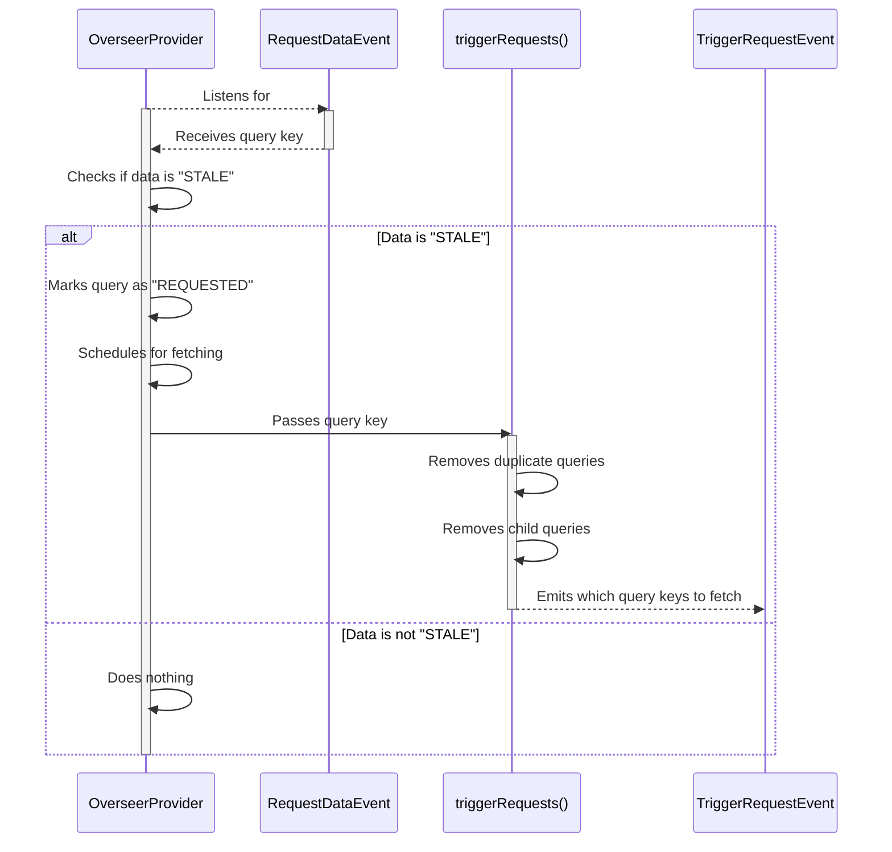

# OverseerProvider

The `OverseerProvider` listens for `RequestDataEvent` receiving a query key. If the data under this key is "STALE" it marks the query as "REQUESTED" and schedules it for fetching.
The fetching is debounced, it removes any duplicate queries or child queries and emits a `TriggerRequestEvent` passing a list of query keys that need to be fetched.
