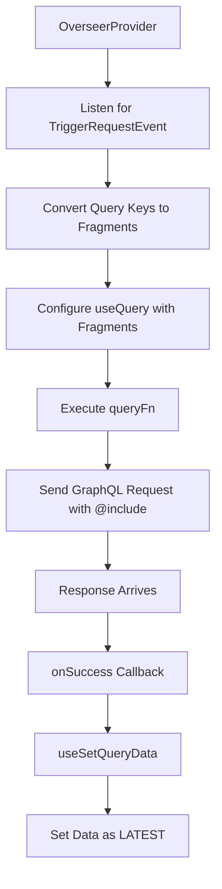

# Query Flow

The flow begins with an `OverseerProvider` emitting a `TriggerRequestEvent` which contains a list of queries to fetch. If our provider manages any of these queries, we convert them to fragments. We then execute the `useQuery` `queryFn()`, passing the fragments along as `@include` variables.
When the data arrives, we handle the response in the `onSuccess()` callback, using the `useSetQueryData` to set each piece of data under a key in the React Query cache, marking the query key as "LATEST".
