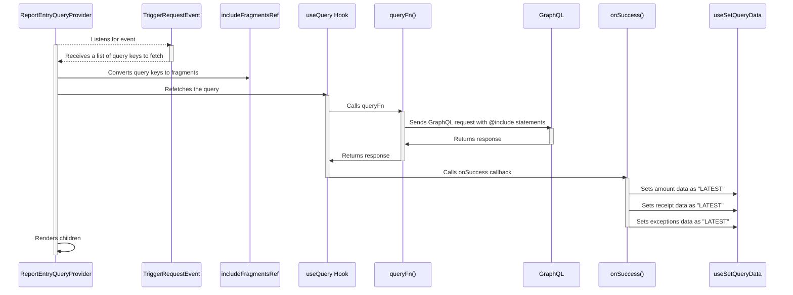

# ReportEntryQueryProvider

The `ReportEntryQueryProvider` listens for `TriggerRequestEvent` receiving a list of query keys to fetch. This list is converted into a set of known "fragments" which are passed into the `useQuery` hook's `queryFn()`. These fragments are passed into the GQL query as `@include` statements.
A GraphQL request is made and when the data arrives it is handled by the `onSuccess()` callback. This callback walks throught the response using the `useQueryData` to set the returned data as "LATEST".
