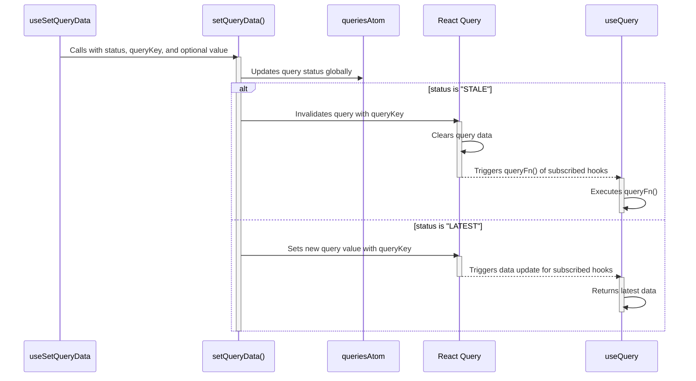

# useSetQueryData

The `useSetQueryData` hook accepts a query status, query key and an optional value.
We use the `queriesAtom` to update the query status globally.
If the query status is "STALE", then we use React Query to invalidate the query. This clears its data and forces any subscribed `useQuery` hooks to trigger their `queryFn()`.
If the query status is "LATEST", then we use React Query to set the new query value. This triggers any subscribed `useQuery` hooks to return their latest data.
