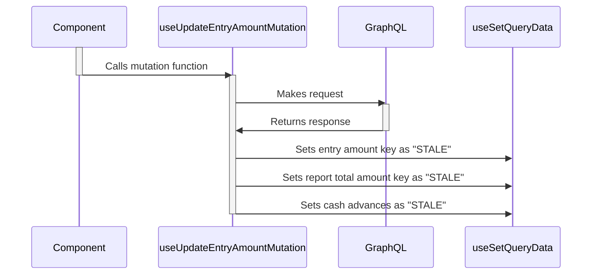

# useUpdateEntryAmountMutation

The `useUpdateEntryAmountMutation` hook returns a `mutation` function which components can use to mutate data. When a mutation gets trigger, the `mutationFn` function gets called. It makes a graphql request.
When the request response arrives, we use the `useSetQueryData` to set the entry amount, report toal amount and cash advances query keys as "STALE".
